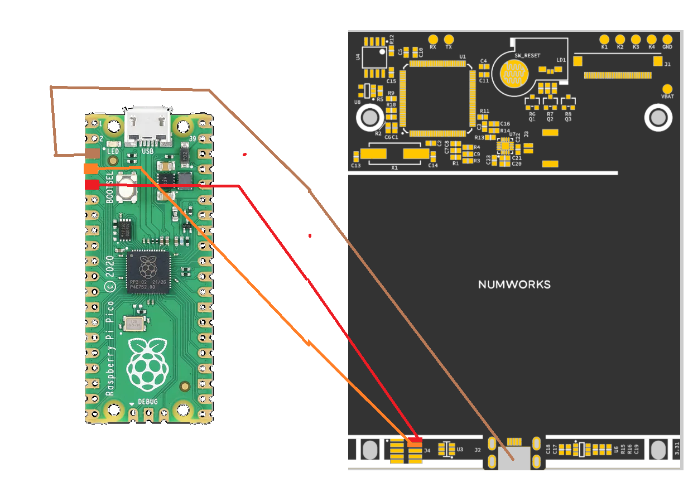

# Restore Numworks firmware (Original guide by RapidZapper)

# /!\ DOESN'T WORK ON N0120/EX, DO NOT TRY <OR IT WILL BREAK YOUR CALCULATOR?>

You own a Numworks Calculator? You're a tinkerer and want to use your Numworks as your developpment platform during the holidays? Great! But now your calculator doesn't boot or you wish to come back on a "stable" base, we're going to show you 2 methods to start again with you Numworks!

### 1) The "Official" Method | N0100 & n0110 with Epsilon Firmware < 16

This method is very probably the easiest to restore your Numworks, and it only requires a computer with a WebUSB-compatible browser such as Chrome, Chromium or recent Edge.

Requirements:
- Numworks Calculator N0100 or N0110 with Epsilon Firmware < 16
- microUSB cable to connect the calculator to the computer or equivalent device
- computer with any OS

Resources:
In order to install the firmware, you'll need a light "recovery" firmware that will allow installation of the normal firmware.
For that you have 2 possibilities:
- by Numworks' website (account needed) : [https://my.numworks.com/devices/](https://my.numworks.com/devices/)
- by Omega's website (no account needed!): [https://getomega.dev/install/latest](https://getomega.dev/install/latest)

In this tutorial, we're going to use the firmware form the Omega website, for its simplicity and the way more interesting features of the firmware!
In the end will still be able to come back to Epsilon if you wish.

1. Place the calculator in "Bootloader" mode by pressing 6 and reset (buttom at the back of the calculator)
2. Connect the calculator to the computer and go to Omega's website installation page (link above)
3. Select "RECOVERY" in order to install the recovery firmware
4. On the windows that pops up, select "STM32 BOOTLOADER", then the firmware will install

Warning: If the calculator reads "numworks.com/recsue" or is recognized as N???, it means you have Epsilon 16 installed on it, if you have a N0100 you can then proceed to the installation of Omega, but if you have a N0110, you can either install the official firmware on Numworks website (link above) or proceed to the second method below to install Omega.

5. On the website, a button reading "Install OMEGA" will show, you can click it to complete the installation.
Your calculator is now working again!

### 2) (Raspberry Pico) Lifebelt for <??> | N0110 >= E16

2022 New, in shortage context where prices and availability of the Raspberry Pi are low, it's now possible to use the Raspberry Pico, the little guy of the <bunch?> in order to get back full control over your Numworks 😛.

Without any further ado, here are the requirements:

- N0110 Numworks Calculator (with Epsilon firmware >= 16)
- microUSB cable to connect the calculator to the computer or equivalent device
- computer with any OS (the pack supplied is for Windows, but could be used on Linux with a little tweaking
- Raspberry Pi Pico (preferably H or WH model or standard model with cable soldering)

In order to avoid any problem it is highly recommended to have a header to connect the female-male jumpers to the Pico or to solder male-male jumpers to it, because the contact must be perfect in order to avoid any problem with the procedure.

This method targets Windows, but it should be possible to adapt the `openocd` command to Linux (not tested)

Video (in french)  [https://www.youtube.com/watch?v=ByPRX63qQMY](https://www.youtube.com/watch?v=ByPRX63qQMY)

1. Download the ZIP pack and extract it: [https://bit.ly/3dpwQu8](https://bit.ly/3dpwQu8)
2. Connect your Pico while maintaining the button pressed, you should get acces to the Pico from your file explorer. Drag and drop the "picoproble.uf2" file to your Pico, it should reboot and be ready.
3. Connect the cables as shown in the picture: 
4. For an optimum operation, go the the recovery menu by pressing 6+reset, and continue from there when the recovery srceen shows up
5. Connect the Pico to the computer and go to the folder you just extracted, then start "unlock.bat"
6. Proceed to reboot the calculator by launching "reset.bat" and verify that the operation went successfully with "readInfo.bat". If it went well you should get
```
stm32f2x user_options 0xCFC, boot_add0 0x0080, boot_add1 0x0040
stm32f2x optcr2_pcrop 0x00000000
```
If `boot_add1` is 0x0080 the the operation hasn't worked, you have to restart at step 5.

Now you can unplug the Pico from the calculator and plug the calculator via USB to your computer. Press 6+reset and you should be able to install Omega (follow method 1) and start again your experimentations with the calculator!